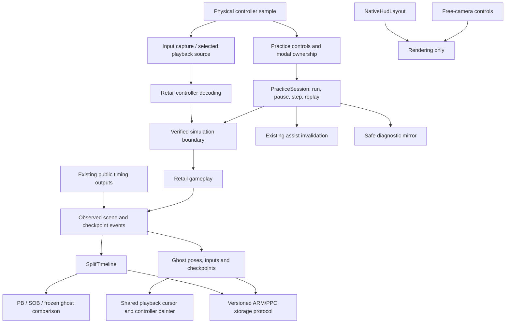

# Moonshine V2.3.0 — Frame by Frame

Planning baseline: V2.2.0 **The House Always Wins**, commit
`080d78fc6504df3f02f33003965e2471a90bc1a4`. Inspection: 2026-09-04–05.
This is an architecture proposal, not an implementation or a release promise.

The recommended release has three connected parts: precise practice controls,
recordings that explain a run, and a clearer interface. Establish simulation,
input, memory, and eligibility boundaries first; then build the features on
those boundaries. Deterministic replay is a gated engineering objective, not
a label to put on an ordinary input recording.

**Accepted memory direction:** the user reports approximately 997 KiB remaining
in the most demanding level and requests a 256 KiB increase. Plan V2.3 around
a **768 KiB MEM1 mod reservation**, leaving approximately 741 KiB of that
reported stage headroom. This is a user-provided hardware measurement, not a
new measurement from this task. The release need not be squeezed into V2.2's
existing 8.7 KiB low-image margin. Preserve timer code and its existing scratch
addresses while implementing the larger reservation.

## Baseline and boundaries

The authoritative repository was read at
`C:/Users/Dogec/susamune/.worktrees/v2.2-zeta`. That checkout was on diagnostic
commit `1e06a62`, so its working files were not used as the release baseline.
Its official release branch was fetched locally, and this task's separate
worktree was placed on `codex/v2.3-frame-by-frame-planning` at `080d78f`.
The outer main checkout, release branch, and diagnostic branch were not edited.
Future implementation branches should descend from this release-based planning
branch, never from the diagnostic branch.

**Timer code stays read-only.** In particular, do not edit, reformat, instrument,
refactor, move, or patch `src/qft_timer.cpp`, its timing state, or its hook
implementation. Do not change existing timer call ordering/cadence as an
indirect workaround. New systems may read existing public outputs, including
`currentQf()`, `attemptSerial()`, and `transitionEntryQf()`. Existing consumers
retain ownership of destructive `consume*()` methods. Any design that proves
impossible under this boundary must return for explicit permission in that
implementation task. This document does not grant that permission.

Existing split storage also remains intact in the conservative plan below;
the earlier size audit explicitly excluded moving its state. New split detail
is a surrounding system, not a reason to relocate the old timer/split payload.

The game reference is [doldecomp/sms](https://github.com/doldecomp/sms), explicitly
supplied by the user. Pin the decomp revision used for each hook investigation.
Use its types and code paths together with the three retail maps/disassemblies:
upstream is incomplete, and its current README does not establish matching
US/PAL implementations. A JP field or hook address is not proof for another
region.

Preserve savestates, ghost Watch/Watch 2/racing, protected unsaved ghosts,
records, 210 achievements, Full Reds, profiles, slot-B Dolphin persistence,
INI recovery, real-disc boot, reset behavior, and SD/USB ownership. A proposed
exception must be named and tested. No release or SD installation is part of
this planning phase.

## Feature map

| Request | Existing V2.2 foundation | Proposed extension | Principal gate |
|---|---|---|---|
| Frame advance | `main.cpp` overlay freeze, `MarDirector`, binds, assist invalidation | `PracticeSession` simulation permissions and a separate frame counter | Identify exact simulation boundaries in JP/US/PAL |
| Free camera while paused | `CPolarSubCamera`, ghost observer camera, rendering hooks | Temporary render-camera transform, independent camera controls | Camera/culling/light ownership; retail camera implementation incomplete |
| Input recording/replay | raw `JUTGamePad` sampling, savestate snapshot, ghost timeline | `InputStream`, seed metadata, playback injection, divergence checks | Reproducible state and input-decode boundary |
| Remaining in-level splits | `SplitEvents`, 132 route IDs, V8 statistics | `SplitTimeline` plus independently persisted expanded checkpoint details | 73 finish-only routes; old mailbox is full |
| Ghost input display | existing controller painter and ghost playback cursor | Explicit controller snapshot input to painter | Align inputs with displayed poses, not an unrelated timer read |
| Ghost splits/comparison | SGHF V4, `RaceContext`, PB overlay, gold durations | SGHF V5 sections and immutable comparison snapshot | New file/storage protocol and memory allocation |
| Menu cleanup | four roots and two nested hubs; category/page descriptors | Six task-oriented roots, one canonical home per control | Preserve modal behavior, favorites, IDs, and all existing destinations |
| Prettier UI | heapless text/box/polygon primitives, Creation styles | Shared spacing/type/color rules and stronger hierarchy | Measured code budget and composite-video readability |
| EN/JA guide | README, inherited launcher README, scattered test sheets | Parallel maintained runner guides | Accurate UI paths, storage paths, Japanese review |
| Faster startup | direct-path autoboot, lazy mounts, bounded asset extractor | Eliminate verified unrelated probes; share exact-path extraction | Cold/warm hardware measurements and fallback preservation |
| Move/resize Sunshine Timer | tagged J2D timer subtree; existing native style editor | `NativeHudLayout` draw-time transform | Compose with existing timer placement without changing timer code |
| Better crash reports | 2 KiB report in 4 KiB MEM2 window, ARM A/B files | Safe core capture, acknowledgement, photo page, decoder | Exception display ownership and unavailable-storage path |

## Shared architecture

Use small C-compatible records and bounded queues. The diagram describes
ownership; it is not an instruction to reorder the current retail/timer calls.
Keep file parsing and storage transactions off the simulation path.

### Stage lifetime

Introduce a monotonically increasing stage generation outside the snapshot.
Before asynchronous setup or teardown, invalidate camera, actor, pane, and
replay handles. A handle is usable only when its generation, director, scene,
heap, and completed-setup state all match. Pointer equality alone is insufficient:
the next stage may reuse the same addresses.

Clear or revalidate handles after savestate restoration even when the scene
has the same name. Preserve the existing post-`GXDrawDone` load barrier and
card-worker waiting behavior. Menu, crash, and storage service remain live
while gameplay is paused. Stage transitions cancel queued steps and freecam;
replay transitions require an explicitly supported segment policy.

### Input ownership and eligibility

Use an explicit priority: emergency abort/reset; active modal; freecam controls;
practice controls; replay/gameplay. Preserve raw physical input for abort/menu
handling even while injecting a replay. Consume each physical edge once and
require release on modal changes. Existing duplicate ordinary binds continue
to fire together; modal ownership must not accidentally become a global bind
arbitration change.

Enter frame pause, step, replay injection, or live-world freecam through
`ILing::invalidateForAssist()` before any assisted simulation. It already
propagates to Records, split eligibility, and playlist credit. Add a latched
reason outside timer state; turning the tool off does not restore eligibility
for that attempt. The existing function returns when no IL is active, so the
session must retain the reason and apply it if an IL becomes armed later.
Preserve special achievement exceptions for their existing
matching RNG controls; the new tools must not inherit those exceptions.

Recording normal inputs, displaying ghost inputs, choosing a comparison, and
moving a HUD element are observational/presentation actions and remain eligible.
Watch retains its existing observer exclusion. Display a readable reason such
as “Practice only — frame advance,” alongside existing PB Safety information.

## Frame advance and camera

### Frame advance contract

Define the first public unit as **one normal gameplay update with its normal
logic substeps**. It is not one video retrace and not one quarterframe. Name and
document the measured unit after verifying the retail loop. A finer individual
logic-tick mode can follow only if it can be implemented without changing timer
hooks or their semantics.

Proposed states are Running, Paused, StepQueued, Replaying, and Transition.
A fresh Step press queues one unit; initially no hold-to-repeat. Consume it
only at a verified simulation boundary. Paused frames still render and poll
controls. A separate practice counter reports completed units. The Sunshine/QF
timer keeps its existing semantics; this plan does not promise it freezes or
becomes a replay clock.

V2.2's borrowed `STATE_STAGE_EXIT_2` is useful prior work but insufficient.
The decomp shows director counters, collision work, and `movement()` can still
run in a nominally frozen director. `main.cpp` also continues feature/action,
ghost, and statistics passes. Conversely, skipping `direct()` wholesale risks
skipping render-list preparation. Identify and gate the actual simulation
groups, preserving draw work and the existing timing calls. Maintain an
explicit inventory of every world-mutating mod pass and its pause policy.

If a world update and protected timer hook are inseparable at a proposed
boundary, that candidate fails the read-only requirement. Investigate another
surrounding boundary; do not silently move the timer call.

Initially permit activation only in a fully loaded normal gameplay state.
Reject activation during fades, dialogs, movies, card transitions, and stage
loading with a short reason. Add states individually after tests. Disable
Fast Forward while stepping and terminate/cancel stepping before warp/restart.
Allow explicit savestate load while paused through the existing deferred load
path; after load remain paused, clear pending steps, rebase input edge history,
and keep the attempt assisted.

Absolute-time gameplay needs a separate gate: native Piantissimo/blooper
stopwatches use OS time, so pausing movement alone does not preserve their
deadlines. Do not globally alter `OSGetTime` or change protected timer code.
Identify a permitted surrounding solution before claiming exact continuation
for those missions; until then label them unsupported for exact stepping/replay.

Budget: approximately 128–256 bytes of session/control state plus a small
event ring, excluding code. Append bind IDs; recommend new destructive/conflict-
prone controls start Unbound until defaults have been tested against all current
combos. Provide the same actions through Practice so they remain discoverable.

### Free camera

Use a separate pose `{position, orientation, FOV, movementSpeed}`. While paused,
the physical controller moves the camera; stepping with freecam active uses
a separately latched gameplay input, shown in the input panel. Camera-control
buttons must not leak into the stepped game. Initially choose between neutral
gameplay input, held input captured on pause, or recorded input; use an explicit
selection rather than guessing from sticks currently driving the camera.

Apply the free-camera view only for the rendering/culling work that needs it,
and restore the canonical camera before controller meaning and gameplay run.
Mario's camera-relative controls and simulation-camera history remain intact.
Use coherent view, projection, frustum, and relevant lighting matrices; replacing
just one global matrix is not enough. Bound speed/FOV, preserve aspect ratio,
and invalidate all cached camera pointers on stage changes and restores.

Do not reuse Watch's Mario-anchor mechanism as freecam: it changes world state.
The upstream `Camera/cameragc.cpp` implementation is incomplete, so hook selection,
collision/culling behavior, and regional layouts need reverse engineering.
Start with freecam only during paused live gameplay; Watch integration follows.
Allow up to 1 KiB including saved render state, finalized after the exact matrix
set is known. Allow another 1 KiB for narrow input-decode history and snapshots.

## Inputs and deterministic replay

### Capture and playback boundary

The retail application reads/decodes the pad before Moonshine's current
`onUpdate`. `JUTGamePad::read()` runs PADRead, PADClamp, then decoding, and the
director adjusts edge/meaning state across its logic substeps. Appending a
recorder to `gBinds.update()` would be too late for precise injection.

Investigate an adapter immediately after PADClamp and before retail decoding.
Record the controller packet actually consumed by gameplay, not menu navigation
or the latest physical sample seen during a paused render. Preserve button bits,
both sticks, both analog triggers, analog A/B, and controller error status.
Use a canonical **12-byte packet** with defined zero padding, plus a counted
consumption timeline. Capture additional meaning/cadence flags only if the retail
path proves they cannot be derived reproducibly.

Playback replaces the gameplay source at that boundary while retaining a
separate physical abort source. Preserve disconnect/error handling deliberately.
Physical polling continues during pause, but narrow JUT edge/repeat history and
`TMarioGamePad::updateMeaning()` countdowns must advance only for consumed
gameplay updates, or be restored/rebased equivalently. Both run before the
current `onUpdate`; gating only the director would lose edges and drain counters.
Track capture index, consumed update index, scene segment, and displayed pose
index independently. Never interpolate button presses; hold a packet until the
next recorded consumption event. Optional run-length encoding saves disk space
only after a bounded uncompressed path works; budget for worst case.

### What determinism requires

An input stream alone is insufficient. A replay seed must bind disc revision,
Moonshine build/compatibility ID, scene/parent episode, snapshot schema, simulation
cadence, relevant settings, RNG/game state, and narrow controller edge/meaning
history. The current snapshot deliberately omits OS/JSystem/audio state; JUT
pad edge/repeat history is among the omitted dependencies. Never restore whole
OS, audio, or JSystem state to fill this gap.

First target: **same-session, same-scene seed replay** on the same build and
region. Add an opt-in seed capture at the safe post-GX boundary; keep ordinary
savestate save behavior unchanged. Use the existing snapshot slot as the one
seed initially, visibly pinning it for recording/replay. Replacing that slot
ends the replay session after a concrete warning. Do not quietly overwrite a
runner's normal snapshot. A second full snapshot cannot be promised from the
existing MEM2 map.

Do not simply call the existing `saveState()` from a new phase: it calls
`gQFTTimer.onSavestateSaved()`, which would move a protected timer callback.
The seed path must preserve all existing timer callback phases and behavior;
if its consistency requirements cannot be met that way, seed implementation
requires explicit permission and remains a gated milestone.

Each replay has cheap periodic fingerprints: Mario position/velocity/state,
game RNG, selected flags, relevant objective state, and simulation index.
Compare at fixed update indices. On mismatch, stop injection, display the first
detected mismatch and the interval since the last matching checkpoint, retain
diagnostic details, and leave the attempt assisted. A matching sampled fingerprint
is evidence, not a proof that all game state matches. Exact first-frame
localization needs per-frame evidence or replay-to-localize.
Keep FP behavior, real-time-dependent systems, async activity,
camera meaning, particles and actor RNG order on the investigation list.

Persisted input files may initially support learning/inspection without replay.
Cross-boot replay requires a reproducible initializer or relocatable state
format, and cross-region replay is out of the initial deterministic contract.
Raw heap snapshots contain absolute pointers and are not a portable replay
format. Multi-stage deterministic replay is a later gate; stage loading, RNG,
and settings transitions must be represented and validated first.

## Splits, ghosts, and comparisons

### Actual coverage

V2.2 has 132 routes, 285 segments, and 153 intermediate checkpoints. Of those
routes, 59 already have intermediate checkpoints and **73 finish only**. The
backlog is therefore finite:

| Group | Finish-only routes |
|---|---|
| Bianco (5) | 1; 3 Reds; 6 Reds; 8; 100 |
| Ricco (3) | 4 Reds; 8; 100 |
| Gelato (12) | 1 Full, Secret, Reds; 2; 3; 4; 4 Inside; 5; 6; 8; Hidden; 100 |
| Pinna (7) | 1; 2 Reds; 5; 6 Full; 6 Reds; 8; 100 |
| Sirena (4) | 2 Reds; 4 Reds; 8; 100 |
| Noki (4) | 6 Reds; 8; Hidden; 100 |
| Pianta (4) | 5 Reds; 8; Hidden; 100 |
| Airstrip (2) | 1; Reds |
| Delfino (16) | Cop Secret; Pachinko; Slide; Lily Pad; Grass Secret; Lighthouse; Box Game 1/2; Left/Right Bell; Chuckster; Shine Gate; 100; Underbell; Beach Shine; Gold Bird |
| Plaza approaches (6) | Pianta Enter; Ricco Enter; Bianco II Enter; Sirena Enter; Noki Enter; Corona Enter |
| Full Reds (10) | Bianco 3/6; Ricco 4; Gelato 1; Pinna 2/6; Sirena 2/4; Noki 6; Pianta 5 |

These are route variants, not 73 distinct physical Shines. “All remaining”
means every row receives an explicit checkpoint decision and test. A very
short route may properly remain finish-only if no useful intermediate event
exists; make that an explicit runner-facing decision. Airstrip 1 and Pinna 1
previously lost unreliable checkpoints, so do not simply restore old code.

### Event and detail model

Add `SplitTimeline` with stable semantic checkpoint IDs and a per-route schema.
An accepted event carries attempt serial, route ID, checkpoint ID and cumulative
QF. Deduplicate by attempt/checkpoint, validate order, and preserve simultaneous
events. Scene crossings retain parent-episode identity for Full/Secret/Full Reds.

Observe the existing `SplitEvents` event parameters and downstream IL results;
use the exact finish result already produced by ILing. Do not call timer
`consume*()` methods a second time. For new checkpoints, use existing public
clock/transition-entry reads and verified retail acquisition/state edges.
Legacy checkpoints available only inside private split logic need a verified
external observer before ghost details can be claimed; do not guess timestamps
from a saved PB or modify protected internals to expose them.

Keep the existing maximum of five intermediates plus finish initially. Red
coins can use accepted acquisitions at 1/4/8; 100 coins can use 25/50/75/100.
Process all crossed thresholds if one update awards several coins. Full Reds
also needs outside-to-secret entry. A collected actor must not trigger twice.

Secret platforms and approach routes need runner-approved location/status
crossings with hysteresis and single-fire behavior. Boss and objective routes
need actual objective edges: mirrors, Wiggler phases, Sand Bird progress,
balloons, Yoshi fruit/barriers, bell cleaning, boxes, birds, and race progress.
Inspect actor types/nerve transitions and regional identities before choosing
hooks. Start with shared acquisition/transition detectors, then small course
batches. Route labels alone do not justify hard-coded guessed events.

Keep V8 totals, attempts, PBs, and golds intact. Store new-route details in a
versioned `SplitExpansion` sidecar keyed by region/profile/route/checkpoint schema.
Historical intermediate times are unknown, not zero. A PB detail record binds
the associated finish time and a new result identity; invalidate association
on PB replace/delete/profile changes. Matching finish time alone is insufficient
when two different runs tie. Unmatched historical PBs display no detail while
their existing total stays valid.

### Comparison selector

Append one setting, default PB to preserve V2.2 behavior. Its exact cycle is:

**Off (0) → PB (1) → SOB (2) → Ghost (3) → Off.**

Never skip unavailable choices or silently fall back to PB. Off hides comparison
only. PB uses the matching profile/schema. SOB adds best segment durations up
to the checkpoint; it does not compare against the full-run SOB at every split.
Missing golds make the corresponding cumulative comparison unavailable.

Ghost uses recorded cumulative checkpoint QFs from the selected opponent pinned
at attempt start. Extend existing `Ghost::RaceContext` identity rather than
creating a competing selection system. Deleting or replacing a file mid-attempt
must not change the comparison; retain the small immutable split snapshot.
Initially require the same region, route variant and checkpoint schema for
comparison while preserving foreign-region visual playback. Show “No matching
ghost splits” or `--` for older or incompatible ghosts. In Watch 2, make the
primary comparison target explicit. Keep gold highlighting distinct from delta
color, and preserve ghost-achievement opponent locking.

### Showing ghost inputs

Extract the existing controller drawing code into a painter taking an explicit
`InputSnapshot`; live and ghost views provide separate sources. The existing
renderer mixes raw buttons/triggers with clamped stick values, so standardize
normalization before comparing them. Rendering must never inject inputs into
PAD globals.

Use the same cursor that prepares the displayed ghost pose, including the
render-time adjustment, scene segments, Watch speed and pause state. Label the
source “You,” the ghost name, or “Ghost 1/2.” Initial options: Off, selected ghost,
or You + ghost. Two compact input panels are preferable to mixing both sources
in one controller silhouette. On old recordings show “Inputs not recorded.”

### Ghost format and storage

Current SGHF V4 has a 256-byte header, up to 64 scene segments of 32 bytes,
16-byte visual samples, and a maximum of 26,974 samples. Maximum canonical file
size is `0x69EE0` (433,888 bytes). Runtime supports V3/V4; V1/V2 are intentionally
rejected. Preserve those readers and their safety policy.

Propose **SGHF V5** with a bounded section directory: poses, scene segments,
attachments, optional input stream, checkpoint events, and optional replay
metadata. Each section has type/schema, count/stride, offset/length, checksum,
and required/optional semantics. Validate arithmetic without overflow, overlap,
ordering, bounds, region, schema, and checksums before publishing playback.
Unknown required sections fail safely. Inputs-present and replay-capable are
separate capabilities. Never fabricate absent inputs or split history.

Budget up to 512 checkpoint events × 12 bytes = 6 KiB per recording; ordinary
six-endpoint runs need only roughly 64–128 bytes including identity. Size inputs
by actual consumed cadence. A 12-byte packet at 30 Hz for 15 minutes costs
324,000 bytes; at 60 Hz it costs 648,000 bytes. V4's sample limit does not prove
input cadence. Three simultaneous tracks at the latter rate need 1,944,000
bytes before metadata. Four timestamp/mapping bytes per packet raise that
worst-case input total to 2,592,000 bytes. Use 16 bytes per consumed sample as
the conservative first budget; a smaller sparse mapping requires proof under
lag, paused rendering and frequent stepping. Ghost poses and inputs need
separate bounds.

The expanded file cannot pass through the current whole-file transfer buffer.
Introduce a versioned, chunked storage protocol which demultiplexes file
sections into existing pose storage and new input/timeline storage. Keep model
heaps, catalog cache, and live poses intact. A provisional 32 KiB transfer
page and a 1.375 MiB (`0x160000`) per-file ceiling fit the stated
15-minute/60 Hz, 16-byte input example plus maximum legacy pose and split data;
finalize from the exact
V5 layout, indexes and validator before coding.

Failed loading must leave old playback intact. Stage incoming poses in the
existing bounded ghost transfer payload, inputs in the spare third input track,
and metadata separately; publish only after the complete file has passed checks.
Serialize catalog/transfer activity until commit. Preserve V2.2's exclusion
between recording and Watch 2 so the third input track can serve as staging;
if no staging track is free, defer/refuse the load rather than overwriting live
data. Commit or rotate input ownership and copy validated poses at a safe render
boundary. Never demultiplex unvalidated bytes into live playback.

A request carries transfer ID, generation, section/chunk offset, length and CRC.
PPC and ARM own separate 32-byte control lines. Flush payload before publishing
the request; invalidate before consuming; acknowledge a chunk before reusing
its page. Timeout is not ownership transfer. Cancel through an acknowledged
protocol or retain the buffer until reset. Writes use frozen completed data,
never a recording being modified underneath ARM.

Retain payload-sync then valid-envelope commit, A/B recovery, exact byte-count
checks, temporary-file cleanup, unsafe/unknown-file protection, and previous
playback on failed load. Existing V3/V4 recordings load without rewrite. V5
creation is opt-in to the new writer; downgrade cannot claim to preserve data
that V4 cannot represent.

## Menu structure and appearance

V2.2 already has four roots: Shined, Settings, ILs, Records. Settings contains
ten children; ILs contains IL selection, Ghosts and Stage Loader. Display-related
controls are spread across Timer and splits, HUD and displays, Appearance and
Layout editor. Adding more nested pages alone will not fix that ambiguity.

Recommended roots, with a single canonical owner for each action/setting:

| Root | Contents |
|---|---|
| Quick | Existing Shined favorites; optionally pinned actions; current practice state |
| Practice | Pause/step/freecam, input recording/replay, savestates and position save/load, restart/warp shortcuts, gameplay assists, RNG controls |
| Runs | IL selection and PBs, Stage Loader/Streaking, split detail/comparison, Records and Achievements |
| Ghosts | Current race target, Watch/Watch 2, recording/save, personal/import/shared library, input view |
| Display | Timer visibility and layout, input panels, metadata, split overlay, movement feedback, HUD/world visualization, Mario/world appearance, menu style |
| System | Button binds, PB Safety details, profile/storage status, guide/version/crash information |

Keep an always-visible compact PB eligibility summary linking to PB Safety.
Put timer freeze options under Practice and timer visibility/style under Display;
this is presentation metadata only, not changed timer behavior. Put a link to
the canonical setting where context is useful instead of duplicating live
controls. Preserve existing profile semantics; a clearer label must not silently
turn region settings into profile settings.

Use a small static page/row descriptor table independent of persisted
`SettingId`/`BindId` order. Stable UI IDs can represent actions and navigation;
persisted settings and binds remain append-only. Favorites reference existing
setting IDs; adding action favorites requires an explicitly versioned tagged
reference, not reinterpreting saved bytes. Generate or audit a complete old-page
to new-page inventory so no setting, achievement view, protected save flow, or
debug-only destination disappears.

Keep A=select, B=back, and existing C-stick navigation conventions; show the
live menu-close bind in the footer. Preserve modal input capture and release
debouncing. Keep depth normally at two levels, with breadcrumb and remembered
cursor. A six-item left navigation rail avoids an overflowing horizontal strip,
but its width must be checked against the longest labels and ordinary TV output.
Prototype that layout before moving functional pages.

For appearance, use the current shared text/box/polygon primitives: consistent
spacing, stronger selected-row contrast, subdued section labels, aligned values,
one accent palette, concise help and contextual button hints. Keep customization
and warnings readable together. Use symbols and text as well as red/green.
Favor 16–18 px body text with 12–14 px secondary text only after TV tests.
Start inside the existing `(40,20,560,400)` panel and validate the visible 448-line
safe region; do not assume the entire nominal 640×480 surface is visible.

A procedural first pass needs no new textures or per-frame allocation. Target
roughly 2–4 KiB additional page/state/string storage and 2–6 KiB code initially,
then measure; these are design estimates, not verified spare bytes. Reuse the
single J2DTextBox. Any richer icon atlas comes later: 128×128 RGB565 is 32 KiB,
RGBA8 is 64 KiB, before objects/alignment. It needs a named allocation. Never
borrow the ghost model heap just because a ghost is currently hidden.

Maintain explicit render order: world and ghost models, native HUD transform,
Moonshine overlays, menu/modal layer, toast/achievement layer and mandatory
eligibility warning. Preserve the established orthographic setup before borrowed
drawing primitives. Watch, wheel, keyboard and result-screen overlaps are
acceptance tests, not cosmetic follow-up work.

## Moving and resizing the Sunshine Timer

Implement a new `NativeHudLayout` module entirely outside protected timer
sources and hooks. The timer lives under J2D tag `\0t_0`; existing code already
temporarily shifts it upward 60 pixels around mission counters. Capture the
native transform **as it exists at draw time**, after retail animation and that
existing shift, then compose the user's translation and uniform scale.

Investigate a narrowly scoped wrapper at the relevant J2D subtree draw call.
Apply a temporary parent/view transform for that subtree and restore exact
incoming state before returning. Default `(0,0,1)` must be an identity path.
Transform digits, punctuation, streak and label as one group. Do not repeatedly
resize pane rectangles, call `setTimer()`, change timing ownership flags, or
reparent panes. Those approaches can change animation, clipping, or protected
placement state. A generic J2D hook must immediately bypass every other pane.

Verify J2D parent/global matrices, scissor propagation, child traversal and normal
versus rush timer groups against decomp and regional disassembly. If the chosen
draw boundary cannot safely scale the subtree, keep the design pending rather
than editing QFT to make room. Preserve existing color/visibility editors and
mission-counter avoidance. The user transform is an offset/scale on top of
native animation; this avoids flattening intentional retail movement.

Store signed offsets and bounded scale in a new versioned style extension,
defaulting to identity on absent/invalid data. Do not grow the existing compact
QFT payload or reinterpret it as the native timer's layout. Reuse Creation's
preview/keep/discard/reset interaction outside timer code. Cache only live-stage
handles and restore temporary drawing state before any savestate capture.
Estimated transform/config state: 128–256 bytes; no new heap object required.

Tests include normal/rush timers, red-coin and balloon counters, Pinna 8,
appear/disappear animation, final results, visibility modes, JP/US/PAL labels,
aspect/video modes, and save/load while the timer is moving. Compare default
layout and all displayed time values against untouched V2.2.

## Startup work and CISO debt

Autoboot already opens the configured game directly and mounts devices lazily.
The remaining source-proven opportunities are specific:

1. Skip `TRISetupGames` only after identifying a supported Sunshine revision:
   it currently performs 15 unrelated four-byte Triforce signature probes.
2. Remove the startup `updateMetaXml()` comparison for packaged Moonshine
   launches: its metadata write path is already commented out. Account for
   legacy directory-creation fallback when the launch directory is missing.
3. Defer 33 ghost-directory existence/creation operations to actual needs.
   Coordinate kernel storage changes, which currently assume those directories.
4. Read autoboot configuration before optional PNG/MP3 loading; load menu media
   only if cancellation/error/menu entry requires it. This deliberately gives
   autoboot a stock lightweight presentation while preserving themed menus.
5. Share one bounded, buffered FST traversal for Shadow Mario and Piantissimo
   exact archive paths. Today two readers repeat entry/name reads and decoding.
   Start with a measured 8–16 KiB loader-only cache. A later validated derived
   asset cache can replace repeated extraction; current combined asset/header
   bytes are 136,928. Key by asset schema and verified content/game identity;
   invalid cache falls back to extraction and must never prevent boot.

Preserve B-to-cancel, ~200 ms controller warm-up, split-device settings ownership,
interactive browsing, reset staging, HID mappings, generic patch-file support,
and the filesystem health probe. Do not remove waits merely because they look
slow. Measure file opens/read bytes and phase times outside timer code, for
cold/warm SD→SD, SD→USB, USB→SD, USB→USB and disc launches, with/without media.
Report menu-ready and gameplay-ready latency separately. No seconds-saved
claim is supported by source inspection alone.

**Compatibility debt:** Nintendont and launcher validation accept 2 MiB-block
CISO, but the ghost-model extractor explicitly rejects it. Fix the extractor's
reader abstraction independently: validate the `0x8000` header and 1,024-entry
map; translate logical reads, split at block boundaries, and zero-fill omitted
blocks. A 1,024×u16 map is 2 KiB temporary storage; no 2 MiB decode buffer is
needed. Test truncation, overflow and present/absent boundary crossings. Preserve
fallback appearance until this is tested. This is a useful early repair, not
the organizing dependency of V2.3.

## Crash reports designed for real hardware

V2.2 already captures registers, exception details, PC/LR windows, stack,
backtrace, director/Mario bytes, build CRC and 16 breadcrumbs. Its report is
2 KiB in a 4 KiB reservation. Keep that core and its ARM A/B files.

Propose crash format V2, at most `0xF00` report bytes inside the same window,
with separate aligned publication/ack lines and guards. Exact field accounting
comes before implementation. Split capture availability from storage availability:
a missing/read-only device must not suppress the photographable report.

Maintain a safe diagnostic mirror during normal execution: build/revision,
platform/video mode, stage generation/readiness, last completed phase,
practice/replay mode and input index, assist reasons, savestate phase,
ghost/storage operation/sequence/status, and memory canaries. Increase to about
32 compact transition breadcrumbs. Avoid per-frame formatted strings and timer
internals. Retain raw addresses for later decoding.

At fault time, publish a minimal checksummed core before optional reads. Guard
each copied range, mark missing sections, and preserve the first core if capture
faults again. Give the core and optional extension independent checksums and
publication state, so ARM cannot mistake a partially extended report for a
complete core. The current code validates a 320-byte director copy but then reads
`_260` beyond that checked range: use independently validated offsets or the
safe mirror, not unchecked live object traversal.

ARM publishes pending/saved/failed with matching report ID on its own cache
line. Add bounded retry for transient failures without overwriting the last
valid A/B pair. Text and binary carry the same generation and checksum identity;
interrupted mismatched pairs must be obvious. Package matching mod/game symbols
with every release and provide an offline binary/text decoder which refuses
to invent symbols for an unknown build.

The essential screen must fit in one stable high-contrast photo without input:
release and region, report ID, exception, PC/LR/DAR/DSISR, scene, last operation,
save status and a short instruction. Use readable separated hexadecimal groups
inside TV-safe margins. Additional pages are optional. Investigate JUTDirectPrint
and the actual chained exception handler/framebuffer lifetime; do not depend
on the normal menu, heap, audio, GX completion or storage succeeding in a fault.

A watchdog is a separate later feature. ARM may preserve the last safe mirror
for a suspected stall, but a missing gameplay heartbeat does not establish a
crash: paused practice, loads and movies stop progress intentionally. No automatic
reset until those cases and GPU/ARM failure limits are understood.

## English and Japanese runner guide

Deliver `doc/guide/en.md` and `doc/guide/ja.md` with matching section IDs,
screenshots and release version. Replace runner-facing reliance on the inherited
launcher README, which still describes removed behavior. Keep historical upstream
material separately available.

| Chapter | English | Japanese |
|---|---|---|
| Install | Download, install and update | ダウンロード・導入・更新 |
| Launch | Choose version and game location; cancel autoboot | ゲームのバージョンと場所を選ぶ・自動起動を中止する |
| Practice | First practice session and button bindings | 練習の始め方・ボタン割り当て |
| Runs | ILs, profiles, splits and PB eligibility | IL・プロフィール・区間タイム・PBの記録条件 |
| Ghosts | Save, watch, race and show inputs | ゴーストの保存・観察・対戦・入力表示 |
| Frame tools | Frame advance, free camera and input playback | コマ送り・フリーカメラ・入力再生 |
| Display | Move, resize and recolor displays | 表示の移動・サイズ変更・色変更 |
| Data | Back up, restore and recover files | データのバックアップ・復元・復旧 |
| Troubleshooting | Report an issue with a photo or text | 写真やテキストで不具合を報告する |
| Dolphin | Emulator setup and persistence differences | Dolphinの設定・保存方法の違い |

Use exact on-screen labels and actual filenames alongside natural Japanese.
Explain that configuration belongs to the launcher's device, not necessarily
SD, and preserve `susamune_*` data names despite Moonshine branding. Include
disc/image choices, supported revisions, default and remapped controls, Full
Reds, slot-B emulator persistence, import/share locations, safely updating
without losing records/themes/BGM, and current CISO fallback status.

Example terminology: frame advance = コマ送り; input recording = 入力記録;
replay = 入力再生; split = 区間タイム; practice only = 練習専用.
Explain deterministic limitations without calling all playback deterministic.
Have a Japanese speaker review instructions, and have a runner unfamiliar with
development complete a clean installation from each guide. PDF comes after
content/screenshots stabilize; guide prose does not belong in scarce in-game
MEM1. In-game help can give short hints and a stable guide link.

## Verified capacity and proposed budgets

### Final release artifact measurements

**The reservation is 512 KiB; code/data is about 343 KiB, not 500 KiB.**
The 8.7 KiB margin below refers to the current 352 KiB code boundary. Another
128 KiB belongs to attachment models, and the final 32 KiB is mostly an
unassigned tail. Those allocations explain the smaller code margin without
implying that code already fills the whole reservation.

The inspected package was
`build/Moonshine_V2.2.0_The_House_Always_Wins.zip` in the authoritative repository.
Its metadata names V2.2.0; the mod headers agree with the adjacent manifests.
These are direct measurements of that saved release package, not a fresh rebuild
or runtime heap measurement. SHA-256:
`34d8a9c95bafab0a1fc488e460eb01e673e7fd9b5a1b26620535b8ab0c718923`.

| Console region | Initialized image | Full runtime image | Packed mod file | Free below `0x58000` cap |
|---|---:|---:|---:|---:|
| JP | 319,456 B | 351,584 B | 319,736 B | **8,864 B** |
| US | 318,156 B | 350,272 B | 318,436 B | **10,176 B** |
| PAL | 318,288 B | 350,400 B | 318,568 B | **10,048 B** |

The saved emulator manifests report 333,868 / 332,524 / 332,716 runtime bytes
for JP/US/PAL; console remains the binding code budget. Final `boot.dol` is
1,112,032 bytes. Historical figures in `v2.2.0-size-audit.md` refer to earlier
builds and cannot be substituted for these release measurements.

The V2.2 MEM1 region is `0x80000`, arena displacement `0x82000`, runtime-image
cap `0x58000`, attachment heap `[0x58000,0x78000)`, and scratch starts at
`0x7FFC0`. The 32,704-byte tail between attachment heap and scratch is not
contiguous code capacity under the current linker/manifest contract. Do not
move the attachment heap or timer scratch to turn it into apparent space.
The heap is already sized tightly for the two attachments.

The JP linked object has 277,148 text, 38,306 rodata, 3,964 data and 31,989 BSS
bytes before alignment gaps; 29,864 BSS bytes are existing split state. Most
of that BSS is excluded from proposed memory optimizations. Non-timer string
pool/descriptor compaction or a verified immutable MEM2 text bank can be studied,
but the entire 38,306-byte rodata total is not a recoverable budget. Such
compaction is optional under the user's larger-reservation decision.

### Accepted 256 KiB MEM1 increase

Increase `mod_region_size` / `SUSAMUNE_MOD_REGION_SIZE` from `0x80000` to
`0xC0000` (512 to 768 KiB). Keep the required `0x2000` debug-stack gap, making
the arena reservation `0xC2000`. The game heap floor rises by exactly `0x40000`.
Carry that same displacement through the manifest, regional validation and
hardcoded heap-patch relocation; changing only one constant would be incomplete.

A conservative layout keeps all existing subregions where they are:

| Offset from each region's mod base | Planned use |
|---|---|
| `[0x00000,0x58000)` | Existing low linked image, 352 KiB |
| `[0x58000,0x78000)` | Existing attachment heap, 128 KiB |
| `[0x78000,0x7FFC0)` | Existing unassigned tail, 32,704 B |
| `[0x7FFC0,0x80000)` | Existing protected scratch, 64 B |
| `[0x80000,0xC0000)` | New V2.3 code/data span, 256 KiB |

Explicitly pin the scratch offset at its V2.2 value: it is currently derived
as `region_size - 0x40`, so a naive size bump would relocate timer state.
Implement the pin in the shared memory-map definition, preserving all resulting
timer addresses and without editing timer implementation. New-module placement
and linker assertions should keep timer sections in the existing low image.
The nominal JP image-growth allowance becomes 8,864 + 262,144 = **271,008 B**
before support code, without needing the old tail.

Use a bounded V3 scatter-load manifest for the two code spans. Validate all
destinations, initialized/payload lengths, memory lengths, overlaps and hook
writes before any copy. Copy initialized bytes and zero only each span's own
BSS; exclude attachment heap and scratch. Synchronize each span before enabling
hooks. Both spans remain within MEM1 branch reach. Old loaders must clearly
reject an unsupported manifest, not partially inject it.

The existing `0x5F000` reset-safe staged-file ceiling is independent of MEM1
capacity. Budget an additional 256 KiB for staging from the generic file-patch
reservation: proposed staging `[0x91E3F000,0x91F00000)`, file prefix `0x9F000`,
and model vault offset `0x9F000`. This keeps the vault itself at its existing
`0x91EDE000` address. Preserve the complete immutable file prefix for reset.
Enforce initialized-file-size and runtime-span limits separately; BSS is not
serialized merely because the reservation grew.

Dolphin DOL/BPS output must load equivalent low/high bytes. Current tooling
emits one enlarged section; verify spare DOL slots and explicit zeroing before
selecting a two-section representation. Regenerate source-free ISO layout
metadata from verified retail images as required. Test JP/US/PAL manifest
validation, heap floor, patch relocation, stage setup, savestates, ghosts and
reset. Recheck the demanding level and other regions to record actual remaining
heap after the increase; use the user's measurement as the planning basis.

### Existing MEM2 constraints

| Allocation | Verified constraint |
|---|---|
| Three ghost slots | 3 × 512 KiB; record/play/transfer are overlaid with models/catalog; only 32 B before transfer's secondary model heap |
| Snapshot | `0xFF0000` = 16,711,680 B, ending at configuration; no reduction justified by current evidence |
| Config/runtime block | 64 KiB; split mailbox `[0x8280,0xF780)` exactly meets PB mirror |
| Main unassigned config interval | Console `[0x92EF5B80,0x92EF8280)` = 9,984 B, derived from current menu-text end and split start; name/guard any use first |
| Menu runtime | Fixed 1,024 B; current constructor must fit, not “1 KiB free” |
| Creation runtime | Fixed 1,280 B, already occupied |
| Live binds | 23 binds; `sizeof(Binds)=56` exactly fills `0x38` slot |
| Persisted wire capacities | 128 settings, 64 binds; 121 settings currently leave only 7 ID slots before a schema-capacity decision |
| Crash | Existing 4 KiB reservation, 2 KiB current report |
| Staged mod/model vault | Reset-safe file prefix `0x5F000` plus immutable `0x22000` vault; not generally reusable |
| Generic file-patch reservation | `[0x91900000,0x91E7F000)`, `0x57F000` bytes; candidate for negotiated reuse, currently owned |

Even one new bind needs a deliberate **PPC live-state** relocation or expansion.
Wire capacity alone does not make appending safe. Keep existing wire offsets,
including QFT config, fixed; put an enlarged live Binds object in a newly named
PPC-only range rather than shifting neighboring protected state. Audit Settings'
live-size assertion as well. Store detailed new modes in a versioned practice
extension to avoid casually exhausting the remaining setting IDs.

### Capacity decision before input work

A concrete candidate is a **3 MiB Moonshine extension reservation** from the
existing generic patch-file range, negotiated for verified supported Sunshine
boots. This is a proposed reassignment, not discovered free RAM. Prove every
reader, reset-time use and generic-game lifetime before selecting addresses.
Either retain the full old patch capacity when new input features are unavailable,
or explicitly document/approve a smaller patch-file limit. Never silently truncate
patches or let runtime input overwrite an immutable reset-time file.

Combined with the staging increase above, one concrete layout keeps the patch
base and conditionally reassigns `[0x91B3F000,0x91E3F000)` for the 3 MiB runtime
extension. The remaining patch bound is `0x23F000`. Bound both raw patch bytes
and generated text-patch output; ARM's runtime patch-count checks must use the
same negotiated limit. Larger existing patch payloads retain their full old
capacity on the compatible legacy boot path, with extension features unavailable.
If a V3 mod's larger staging cannot coexist with a supplied legacy patch, fail
before boot with a concrete reason; do not silently disable or truncate it.
Make this compatibility case explicit in the launcher capability design.
The patch list is reread on reset, so it is never consumed-once scratch. Publish
capability with explicit cache-line ownership after loader writes end; clear only
the new runtime partition/queues on a compatible reset.

Provisional subdivision of that 3 MiB:

| Use | Proposed bound |
|---|---:|
| Record / primary / secondary-or-staging input tracks | 3 × `0xE0000` = 2,752,512 B |
| Chunked file I/O page | 32 KiB |
| Expanded split live data + frozen persistence page | 2 × 32 KiB |
| Timeline controls and capabilities | 32 KiB |
| Unassigned growth reserve | 256 KiB |
| Total | 3,145,728 B |

At 60 consumed inputs/sec, a 15-minute 16-byte packet/timestamp stream needs
864,000 B, leaving 53,504 B inside each proposed track for other metadata. If measured cadence
or required metadata exceeds this, shorten the explicit maximum or revise the
allocation before implementation; no unbounded recording.

For split expansion, 73 routes × 6 segment durations × 5 arrays (four PB profiles
and shared golds) × 4 B = 8,760 B for one region before identities/counters.
The sixth duration is required: an old finish-only gold is a whole-run time,
not the final segment of a newly subdivided route.
A 32 KiB current-region page has plausible capacity; preserving other regions
requires transactional copy-through/independent region records. The equivalent
standalone all-region detail is 26,280 B per copy and does not fit in spare old
mailbox space. Store inactive-region data on disk, with explicit migration
and corruption handling; do not erase it when saving the active region.

Dolphin needs an independently verified equivalent aperture and storage strategy;
do not copy Wii physical aliases into emulator mode or assume extra address space
exists. Capability publication must fail closed with a clear unavailable reason
when launcher/mod generations disagree. Old savestates/ghosts/PBs continue to
work in the fallback mode.

The MEM2 extension pays for recording data and storage, independently from the
accepted MEM1 increase paying for code and small runtime state. Implement the
768 KiB reservation as an early isolated milestone; continue measuring feature
costs, but do not make speculative compaction of existing code a prerequisite.

## Implementation order and acceptance gates

| Milestone | Small deliverable | Runner-facing acceptance test |
|---|---|---|
| 0. Baseline contracts | Fresh six regional/platform builds; protected-file hashes; allocation ledger; old menu/ABI inventory | Existing release still boots, saves, watches/races two ghosts and records PBs |
| 0a. Larger reservation | User-requested 768 KiB MEM1 region, pinned timer scratch, matching manifest/staging and Dolphin outputs | Demanding level retains expected headroom; all three regions boot, reset, save/load and show unchanged timer behavior |
| 1. Independent reliability | Safe crash core/ack; remove verified dead startup work; CISO reader fix separately | Photograph a test report with saving unavailable; boot ISO/CISO/disc and cancel autoboot |
| 2. UI prototype | Static six-root navigation prototype, spacing/colors, full destination map | Find savestates, race ghost, splits and timer layout without instructions; B behaves consistently |
| 3. Simulation research | Three-region simulation/pad-boundary experiment; no protected timer changes | Pause Mario and moving objects for a minute; press Step ten times and get ten defined updates |
| 4. Practice controls | Pause/step, assist reasons, binds relocation, transition cancellation | Step with held/released buttons; load state while paused; warp/reset safely; no PB/achievement credit |
| 5. Render-only tools | Paused freecam and native timer transform as separate changes | Move camera without Mario/world motion; move/resize timer and verify identical time values |
| 6. Memory/storage capability | Audited extension reservation, V5 host/ARM/PPC validators, chunk protocol | Old ghosts still load; damaged files fail cleanly; reset and mixed versions do not corrupt data |
| 7. Input capture/teaching | Canonical input stream; live/ghost painter; one saved V5 round trip | Compare button presses/sticks at start, finish, pause and scene changes; old ghosts say unavailable |
| 8. Comparison and common splits | Exact four-choice selector; pinned opponent; reds/100-coin expansion | Cycle Off/PB/SOB/Ghost even with no ghost; changing selected file cannot change an active race |
| 9. Remaining split batches | A few related routes per change, schema and coverage entries | Complete each checkpoint normally, skip it, repeat it, load a state, and change stage without false splits |
| 10. Seed replay | Same-session replay seed and periodic divergence detection | Replay the same short section repeatedly; deliberately change a dependency and see an honest mismatch |
| 11. Release hardening | EN/JA guides, photographs, six-build and device matrix, file recovery fixtures | A new runner installs/updates from the guide while keeping settings, records, ghosts and themes |

Milestones 1–2 and checkpoint specification can run alongside simulation research.
Native HUD layout can run independently once its draw boundary is proven.
Input capture can precede deterministic replay, but V5 storage cannot precede
its memory/ownership decision. Expanded splits can precede V5 ghost serialization.
Prefer one user-visible behavior per implementation change, with a short test
sheet using actual menu labels.

Required technical checks include malformed/truncated/oversized files, integer
overflow, overlapping sections, checksums, unknown versions, interrupted A/B
commit, late acknowledgements, profile/region changes, tied PB association,
simultaneous checkpoints, and stage-address reuse. Extend existing validators
and meaningful fixtures rather than duplicating implementation in tests.

Hardware coverage must include JP/US/PAL; Wii with SD/USB and real discs;
Dolphin with intended persistence; cold boot and in-game reset; composite and
component; available interlaced/progressive modes; normal gameplay, transition,
Watch/Watch 2, saving/loading and protected ghost replacement. Record separately
what passed host tests, Dolphin, and Wii. A build success is not hardware proof.

## Decisions and confidence

**High confidence:** exact comparison cycle/default; explicit-source controller
painting; versioned sections and chunk ownership; task-based menu metadata;
procedural visual refresh; safe crash mirror; specific unrelated launcher probes;
parallel EN/JA documentation; input recordings distinct from verified replay.

**Needs reverse engineering or measured proof:** simulation/draw separation,
pad injection and substep cadence; canonical freecam matrices; native timer
subtree draw hook and clipping; replay state completeness; certain shine events;
MEM2 patch-buffer reassignment across reset; exception framebuffer ownership;
fresh code/heap high-water budget on all regions.

**Preferences to settle using concrete prototypes:** six root names and favorite
behavior; new bind defaults; latched versus neutral stepping input; useful
checkpoint locations on short routes; single versus dual ghost input panels;
whether initial deterministic replay may pin the one savestate slot. Recommended
defaults appear above; none need block this planning phase.

## Source anchors

All local anchors below refer to the official baseline, not the diagnostic build.

- [Main lifecycle, input, freeze and after-draw ordering](../src/main.cpp), especially `onSetup`, `onUpdate`, `afterDraw`, `onUpdateGameMode`.
- [Public timer interface — read-only](../include/susamune/qft_timer.hxx).
- [Savestate boundaries and validation](../src/savestate.cpp).
- [Menu roots and rendering](../src/menu.cpp), `Menu::Menu()` near line 5606 and `Menu::draw()` near 6080.
- [Creation stage-safe HUD handling](../src/creation_extras.cpp), `onStageSetup()` near 543; [J2D pane layout](../include/JSystem/J2D/J2DPane.hxx).
- [Ghost format](../include/susamune/ghost_format.h), [ghost memory/storage contract](../include/susamune/ghost_storage.h), [runtime](../src/ghost.cpp), [ARM storage](../launcher/kernel/SusamuneGhost.c).
- [Split routes/statistics](../src/split_stats.cpp), [event detection](../src/split_events.cpp), [checkpoint schema](../scripts/split_checkpoint_schema.py), [IL entries](../src/iling_entries.inc).
- [Assist invalidation](../src/iling.cpp), `invalidateForAssist()` near 2306.
- [MEM2 ownership](../include/susamune/mem2_map.h), [MEM1 limits](../include/susamune/mod_bin.h), [shared persistence ABI](../include/susamune/susamune_cfg.h), [live binds](../include/susamune/binds.hxx).
- [Launcher startup](../launcher/loader/source/main.c), [Triforce probes](../launcher/loader/source/TRI.c), [ghost directories](../launcher/loader/source/SusamuneGhostDirs.c), [model reader/extractor](../launcher/loader/source/SusamuneShadowAsset.c), [CISO kernel reader](../launcher/kernel/ISO.c).
- [Crash capture](../src/crash_report.cpp), [report format](../include/susamune/crash_report.h), [ARM crash writer](../launcher/kernel/SusamuneCrash.c).
- [Historical size audit — earlier-build figures](v2.2.0-size-audit.md), [official release changes](v2.2.0-changelog.md).
- [Application loop](https://github.com/doldecomp/sms/blob/main/src/System/Application.cpp), [director loop](https://github.com/doldecomp/sms/blob/main/src/System/MarDirectorDirect.cpp), [pad decoding](https://github.com/doldecomp/sms/blob/main/src/JSystem/JUtility/JUTGamePad.cpp), [input meaning](https://github.com/doldecomp/sms/blob/main/src/System/MarioGamePad.cpp), and [incomplete camera source](https://github.com/doldecomp/sms/blob/main/src/Camera/cameragc.cpp). These upstream references were inspected on `main`, not a verified pinned revision; pin before implementing hooks.
